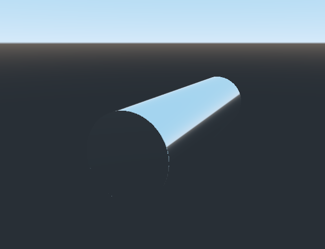

# Bottomliner
This project aims to be a slightly more expensive alternative to [Polyliner](https://github.com/Firepal/godot-polyliner).

The goal of this project is to be able to generate a lowpoly cylinder mesh with multiple "line" segments (3-4 points per segments) with extra vertex attribute data necessary for creating a "cylinder-space" transformation.

This transformation would then allow one to transform an eye vector and a camera position to "cylinder-space", and then _raymarch_ along the multi-segment cylinder.

---

Here is what I have working: One cylinder "line segment" which raymarches a cylinder inside. 

I'm running into problems generating a cylinder mesh with more than one segment...

</img>
</img>

---

Here's a proof of value, simulated using Blender. The cage mesh would be very lowpoly, while the internal cylinder, which would be raymarched in a fragment shader, would appear of infinite resolution.
</img>
